# AELA — Adaptive Extremes Life Analytics

API em .NET 8 (ASP.NET Core Web API) — motor de **ReadinessScore**: o sistema calcula a prontidão de um operador em ambiente extremo comparando suas leituras fisiológicas com o seu próprio baseline individual.

---

## 1. Alunos e RMs

| Nome completo | RM |
|---|---|
| Isabelle Dallabeneta Carlesso | RM554592 |
| Nicoli Amy Kassa | RM559104 |
| Camila Pedroza da Cunha | RM558768 |

---

## 2. Sobre o AELA

**AELA — Adaptive Extremes Life Analytics** é um sistema que transforma dados fisiológicos individuais em **decisões operacionais de missão**.

Por mais de 50 anos, o Human Research Program da NASA documenta o que a microgravidade, a radiação e o isolamento fazem com o corpo humano: perda óssea, alterações cardiovasculares, a síndrome neuro-ocular (SANS), degradação cognitiva. O problema **não é falta de dados** — é que todos os sistemas atuais comparam cada astronauta com **médias populacionais**. Eles confirmam que "o espaço altera o corpo", mas não respondem à pergunta que realmente importa: **qual corpo está mais apto para qual tarefa, agora?**

Essa é a distinção central do AELA:

- Todo sistema de saúde pergunta: *"esta pessoa está dentro dos parâmetros normais da população?"*
- O AELA pergunta: *"esta pessoa específica está se afastando do **seu próprio** estado ideal — e quão rápido?"*

Na prática, é a diferença entre um alarme genérico e uma decisão cirúrgica. Não *"o astronauta B está com a pressão ocular elevada"*, mas *"o astronauta B está mais apto que o A para a EVA de amanhã — use o B."*

O AELA constrói para cada operador um **baseline individual** (o seu "zero" pessoal — frequência cardíaca, tempo de reação, pressão ocular em repouso), monitora o desvio desse baseline em tempo real durante a missão e traduz esse estado biológico em um **ReadinessScore por tipo de tarefa**. Começa no espaço porque é o ambiente mais extremo que existe — mas a mesma lógica protege bombeiros, alpinistas, mergulhadores e equipes de resgate: qualquer corpo operando no limite, sem um sistema que conheça o seu normal.

### O que esta API entrega

Esta API em C# / .NET 8 é o **motor de ReadinessScore** do AELA — o núcleo computacional onde a decisão é, de fato, calculada. Concretamente, ela:

1. **Cadastra operadores** — astronautas e operadores terrestres (bombeiro, alpinista, mergulhador etc.) — e armazena o **baseline individual** de cada um (o "zero" pessoal).
2. **Registra leituras fisiológicas** ao longo da missão, cada uma com timestamp em UTC.
3. **Calcula o ReadinessScore** comparando a leitura mais recente com o baseline: para cada métrica, mede o desvio percentual em relação ao "zero" da pessoa; aplica **pesos diferentes conforme o tipo de tarefa** (uma EVA pesa mais os sinais físicos; uma operação cognitiva pesa mais o tempo de reação); e devolve uma nota de 0 a 100.
4. **Mantém o histórico** de scores de cada operador.
5. **Ranqueia a tripulação** de uma missão da mais apta à menos apta para uma tarefa específica — respondendo diretamente à pergunta do comandante: *"quem faz a EVA de amanhã?"*.

Ou seja, a API não responde "o operador está saudável", e sim **"o operador está pronto para *esta* tarefa, agora"** — que é exatamente o diferencial do AELA traduzido em endpoints.

### As métricas fisiológicas monitoradas

Tanto o **baseline** (o "zero" do operador) quanto cada **leitura** são compostos por três sinais fisiológicos. Cada um deles foi escolhido por mapear diretamente um dos riscos que a NASA documenta no voo espacial:

- **Frequência cardíaca (bpm)** — número de batimentos do coração por minuto. É um indicador direto de esforço físico, estresse e adaptação cardiovascular. Em microgravidade, a redistribuição de fluidos altera a carga sobre o coração; um afastamento grande da frequência basal sinaliza fadiga física ou estresse agudo. No baseline é a `frequenciaCardiacaBasal` (em repouso); na leitura é a `frequenciaCardiaca` (do momento).

- **Tempo de reação (ms)** — quanto tempo, em milissegundos, o operador leva para responder a um estímulo. É o principal indicador de **fadiga cognitiva**: quanto mais lento que o seu normal, mais comprometidos estão o tempo de resposta, a atenção e a tomada de decisão — exatamente a degradação cognitiva que o isolamento e a privação de sono causam em missão. No baseline é o `tempoReacaoBasal`; na leitura é o `tempoReacao`.

- **Pressão ocular (mmHg)** — pressão interna do olho, em milímetros de mercúrio. É o marcador associado à **SANS (Síndrome Neuro-Ocular Associada ao Voo Espacial)**, um dos riscos mais sérios do voo de longa duração, em que mudanças na pressão intracraniana causam alterações oculares que podem comprometer a visão de forma permanente. Um desvio sustentado da pressão ocular basal é um sinal de alerta precoce. No baseline é a `pressaoOcularBasal`; na leitura é a `pressaoOcular`.

O ReadinessScore compara, para cada uma dessas três métricas, o valor da leitura atual com o valor do baseline, mede o desvio percentual e aplica pesos conforme a tarefa.

> **Origem das leituras (matéria de IoT & IOB):** Em campo, nem sempre há wearables disponíveis. Por isso, no conceito do AELA essas leituras podem ser captadas por **visão computacional via câmera**, desenvolvida na matéria de **IoT & IOB** (Python + OpenCV + MediaPipe), que estima sinais como o nível de fadiga (por exemplo, pelo *Eye Aspect Ratio* — o fechamento dos olhos). A ideia é que, futuramente, esse módulo de IoT funcione como o **sensor** que alimenta este motor de cálculo, enviando os dados para serem registrados como uma `LeituraFisiologica`. Nesta entrega, porém, as duas matérias são independentes: esta API recebe as leituras manualmente (via Swagger), e a integração automática entre o módulo de visão computacional e a API fica como evolução futura do projeto.

### Conexão com o tema espacial / ODS

**Tema espacial:** O AELA é a resposta operacional ao conhecimento que a NASA acumulou sobre os riscos fisiológicos do voo espacial. Cada risco documentado (cardiovascular, ósseo, ocular/SANS, cognitivo) vira uma métrica monitorada e ponderada no cálculo do ReadinessScore desta API.

**Conexão com os ODS:**

| ODS | Conexão |
|---|---|
| ODS 3 — Saúde e bem-estar | Medicina personalizada de alta precisão para operadores em ambientes extremos. |
| ODS 9 — Indústria e inovação | Nova infraestrutura de decisão biológica baseada em tecnologia espacial aplicada. |
| ODS 8 — Trabalho decente e crescimento | Redução de incapacitações em missões críticas e proteção de operadores de alto risco. |
| ODS 13 — Ação climática | Dados aplicáveis a operadores em expedições ambientais e zonas de desastre climático. |

---

## 3. Tecnologias utilizadas

- **.NET 8 (LTS)** — ASP.NET Core Web API
- **C#** — POO (herança, classe abstrata, interface)
- **Entity Framework Core 9** — ORM e migrations
- **Oracle.EntityFrameworkCore** — provider do banco Oracle da FIAP
- **Swashbuckle (Swagger)** — documentação e teste dos endpoints
- **IExceptionHandler (.NET 8)** — tratamento global de exceções

---

## 4. Diagrama de classes

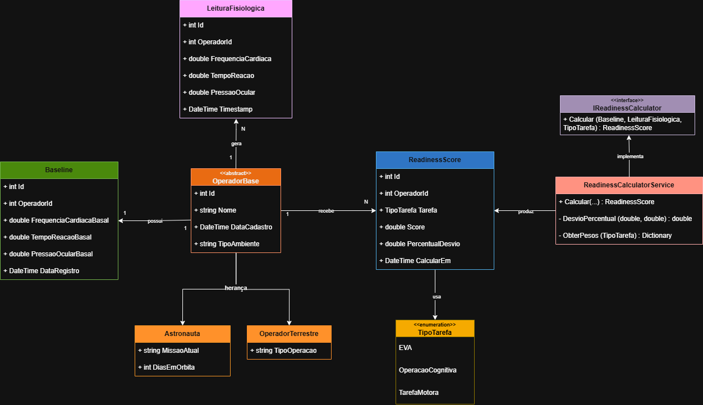

#### Descrição do Diagrama de Classes

**Entidades principais**
- O sistema é composto por operadores, seu baseline fisiológico, suas leituras e os scores de prontidão calculados.
- `OperadorBase` é a classe **abstrata** base, herdada por `Astronauta` e `OperadorTerrestre`.
- `TipoTarefa` é um **enum** que define o tipo de atividade avaliada (EVA, OperacaoCognitiva, TarefaMotora).

**Herança**
- `Astronauta` estende `OperadorBase` adicionando `MissaoAtual` e `DiasEmOrbita`.
- `OperadorTerrestre` estende `OperadorBase` adicionando `TipoOperacao` (bombeiro, alpinista etc.).

**Abstração e interface**
- `IReadinessCalculator` é a **interface** que define o contrato do cálculo de prontidão.
- `ReadinessCalculatorService` implementa essa interface — é onde mora a lógica do score (desvio percentual, pesos por tarefa).

**Relacionamentos**
- Um operador possui **1** `Baseline` (o seu "zero" individual).
- Um operador gera **N** `LeituraFisiologica` ao longo da missão.
- Um operador recebe **N** `ReadinessScore` (histórico de prontidão).

**Regra de negócio (ReadinessCalculatorService)**
- Para cada métrica (frequência cardíaca, tempo de reação, pressão ocular) calcula o desvio percentual em relação ao baseline.
- Aplica pesos diferentes conforme o tipo de tarefa.
- Score final = `100 - soma ponderada dos desvios absolutos` (limitado entre 0 e 100).

---

## 5. Como rodar localmente

### Pré-requisitos

- [.NET 8 SDK](https://dotnet.microsoft.com/download/dotnet/8)
- Acesso à rede da FIAP (VPN ou rede interna) para o banco Oracle
- Credenciais Oracle individuais (RM + senha)

### Configurar a connection string

Edite o arquivo `appsettings.json` na raiz do projeto:

```json
"ConnectionStrings": {
    "OracleConnection": "User Id=RMXXXXXX;Password=DDMMAA;Data Source=oracle.fiap.com.br:1521/ORCL"
}
```

### Aplicar as migrations

```bash
dotnet ef database update
```

### Rodar a API

```bash
dotnet run
```

A API estará disponível em `https://localhost:{porta}/swagger`.

---

## 6. Endpoints disponíveis

### Astronautas

#### POST `/api/operadores/astronautas` — Cadastrar astronauta

**Request:**
```json
{
  "nome": "Neil Costa",
  "tipoAmbiente": "Espaço",
  "missaoAtual": "Artemis-IV",
  "diasEmOrbita": 12
}
```

**Response `201 Created`:**
```json
{
  "id": 1,
  "nome": "Neil Costa",
  "dataCadastro": "2026-05-30T16:40:00Z",
  "tipoAmbiente": "Espaço",
  "missaoAtual": "Artemis-IV",
  "diasEmOrbita": 12
}
```

---

#### GET `/api/operadores/astronautas` — Listar todos os astronautas

**Response `200 OK`:**
```json
[
  {
    "id": 1,
    "nome": "Neil Costa",
    "tipoAmbiente": "Espaço",
    "missaoAtual": "Artemis-IV",
    "diasEmOrbita": 12
  },
  {
    "id": 2,
    "nome": "Ana Buzz",
    "tipoAmbiente": "Espaço",
    "missaoAtual": "Artemis-IV",
    "diasEmOrbita": 12
  }
]
```

---

#### GET `/api/operadores/astronautas/{id}` — Obter astronauta por id

**Response `200 OK`:**
```json
{
  "id": 1,
  "nome": "Neil Costa",
  "dataCadastro": "2026-05-30T16:40:00Z",
  "tipoAmbiente": "Espaço",
  "missaoAtual": "Artemis-IV",
  "diasEmOrbita": 12
}
```

**Response `404 Not Found` (astronauta inexistente):**
```json
"Astronauta 1 não encontrado."
```

---

### Operadores terrestres

#### POST `/api/operadores/terrestres` — Cadastrar operador terrestre

Operadores em ambientes extremos terrestres (bombeiro, alpinista, mergulhador etc.).

**Request:**
```json
{
  "nome": "Marcos Silva",
  "tipoAmbiente": "Terra",
  "tipoOperacao": "bombeiro"
}
```

**Response `201 Created`:**
```json
{
  "id": 1,
  "nome": "Marcos Silva",
  "dataCadastro": "2026-05-30T16:45:00Z",
  "tipoAmbiente": "Terra",
  "tipoOperacao": "bombeiro"
}
```

---

#### GET `/api/operadores/terrestres` — Listar operadores terrestres

**Response `200 OK`:**
```json
[
  {
    "id": 1,
    "nome": "Marcos Silva",
    "tipoAmbiente": "Terra",
    "tipoOperacao": "bombeiro"
  }
]
```

---

#### GET `/api/operadores/terrestres/{id}` — Obter operador terrestre por id

**Response `200 OK`:**
```json
{
  "id": 1,
  "nome": "Marcos Silva",
  "dataCadastro": "2026-05-30T16:45:00Z",
  "tipoAmbiente": "Terra",
  "tipoOperacao": "bombeiro"
}
```

**Response `404 Not Found` (operador inexistente):**
```json
"Operador terrestre 1 não encontrado."
```

---

### Baseline, leituras e prontidão

#### POST `/api/operadores/{id}/baseline` — Registrar baseline individual

**Request:**
```json
{
  "frequenciaCardiacaBasal": 60,
  "tempoReacaoBasal": 250,
  "pressaoOcularBasal": 15
}
```

**Response `200 OK`:**
```json
{
  "id": 1,
  "operadorId": 1,
  "frequenciaCardiacaBasal": 60,
  "tempoReacaoBasal": 250,
  "pressaoOcularBasal": 15,
  "dataRegistro": "2026-05-30T16:40:41Z"
}
```

**Response `404 Not Found` (operador inexistente):**
```json
"Operador 1 não encontrado."
```

---

#### POST `/api/operadores/{id}/leituras` — Registrar leitura fisiológica

**Request:**
```json
{
  "frequenciaCardiaca": 78,
  "tempoReacao": 310,
  "pressaoOcular": 18
}
```

**Response `200 OK`:**
```json
{
  "id": 1,
  "operadorId": 1,
  "frequenciaCardiaca": 78,
  "tempoReacao": 310,
  "pressaoOcular": 18,
  "timestamp": "2026-05-30T16:41:01Z"
}
```

**Response `404 Not Found` (operador inexistente):**
```json
"Operador 1 não encontrado."
```

---

#### GET `/api/operadores/{id}/readiness?tarefa=EVA` — Calcular ReadinessScore

Calcula o score de prontidão do operador para a tarefa informada, comparando a leitura mais recente com o baseline.

**Response `200 OK`:**
```json
{
  "id": 1,
  "operadorId": 1,
  "tarefa": "EVA",
  "score": 97.65,
  "percentualDesvio": 2.34,
  "calcularEm": "2026-05-30T16:41:40Z"
}
```

**Response `404 Not Found` (sem baseline):**
```json
"Baseline não registrado para este operador."
```

**Response `404 Not Found` (sem leitura):**
```json
"Nenhuma leitura registrada para este operador."
```

---

#### GET `/api/operadores/{id}/historico` — Histórico de scores

**Response `200 OK`:**
```json
[
  {
    "id": 3,
    "operadorId": 1,
    "tarefa": "TarefaMotora",
    "score": 97.78,
    "percentualDesvio": 2.21,
    "calcularEm": "2026-05-30T16:42:20Z"
  },
  {
    "id": 2,
    "operadorId": 1,
    "tarefa": "OperacaoCognitiva",
    "score": 98.06,
    "percentualDesvio": 1.93,
    "calcularEm": "2026-05-30T16:42:13Z"
  }
]
```

---

### Missões

#### GET `/api/missoes/{missaoId}/ranking?tarefa=EVA` — Ranking de prontidão da tripulação

Retorna a tripulação da missão ordenada do operador **mais apto** ao **menos apto** para a tarefa.

**Response `200 OK`:**
```json
{
  "missao": "Artemis-IV",
  "tarefa": "EVA",
  "ranking": [
    { "id": 1, "nome": "Neil Costa", "score": 97.65, "percentualDesvio": 2.34 },
    { "id": 2, "nome": "Ana Buzz", "score": 71.20, "percentualDesvio": 28.80 }
  ]
}
```

**Response `404 Not Found` (missão sem operadores):**
```json
"Nenhum operador na missão Artemis-IV."
```

---

## 7. POSTs e GETs

#### POST astronautas

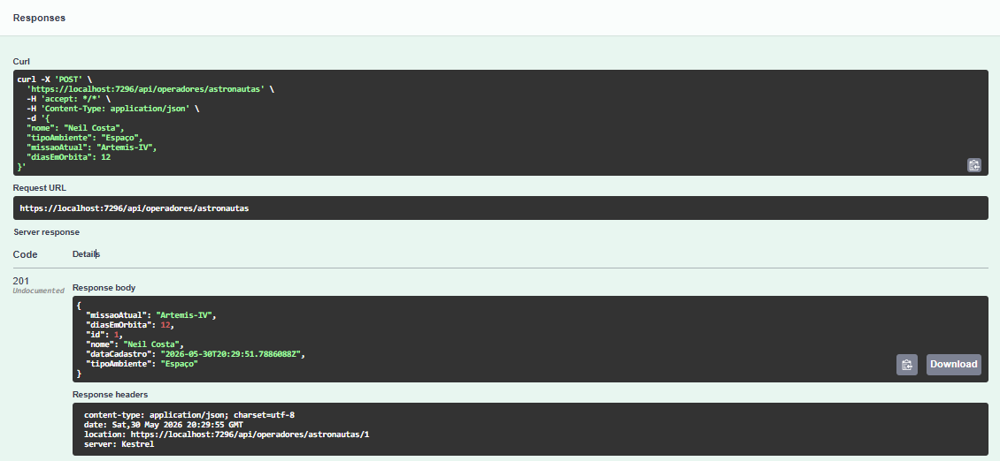

#### GET astronautas (listar todos)

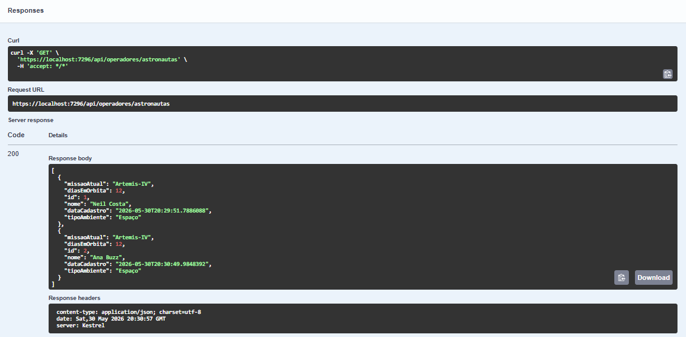

#### GET astronauta por id

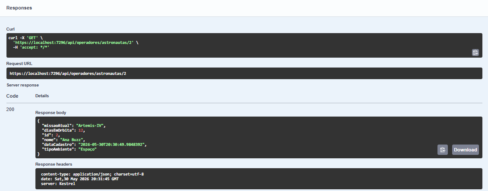

#### POST terrestres

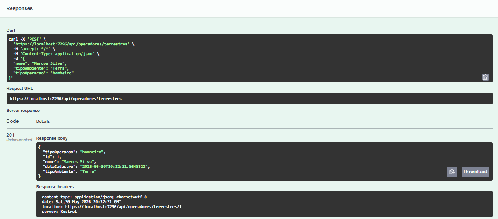

#### GET terrestres (listar todos)

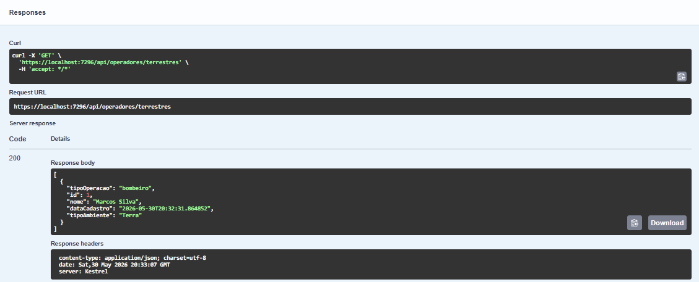

#### GET terrestre por id

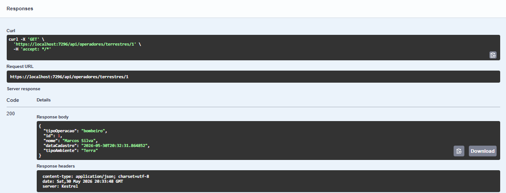

#### POST baseline

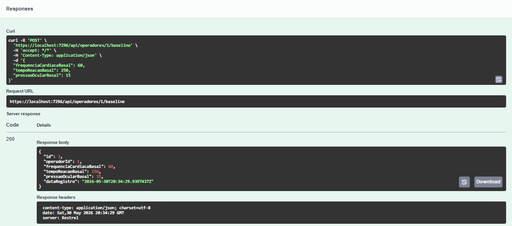

#### POST leituras

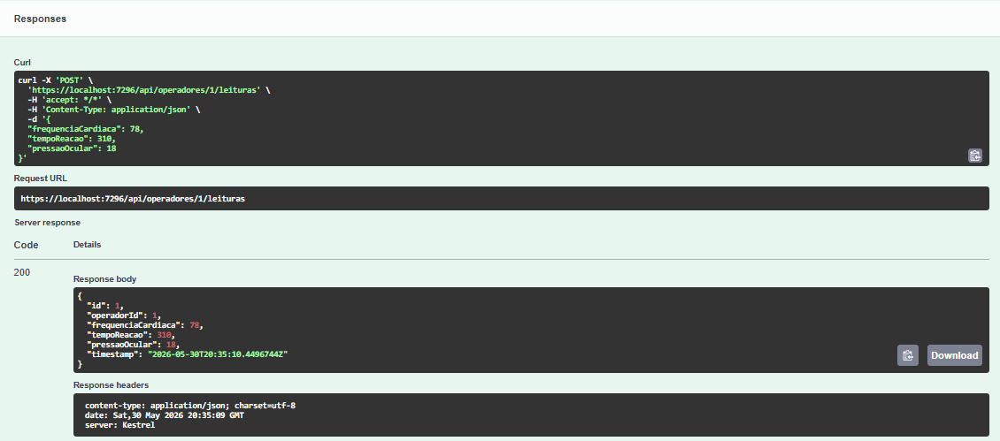

#### GET readiness (cálculo do score)

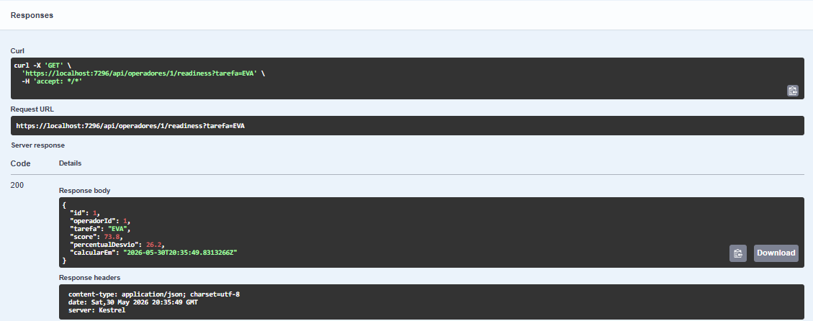

#### GET histórico

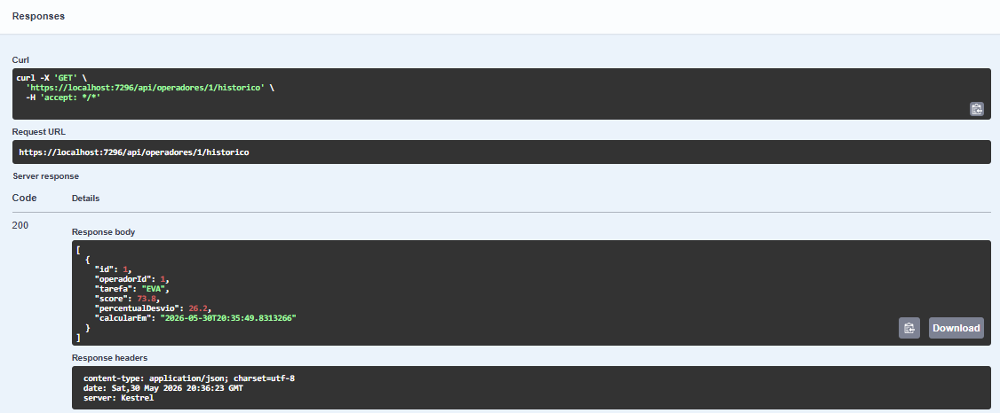

#### GET ranking da missão

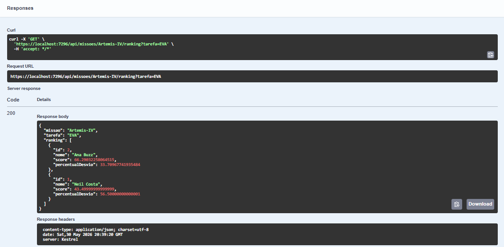

---

## 8. Testes de erros

#### Calcular readiness para operador inexistente → `404`

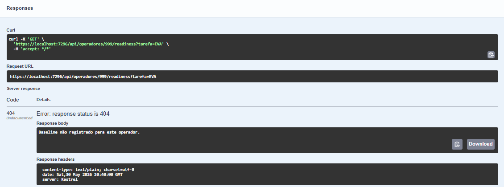

#### Registrar baseline para operador inexistente → `404`

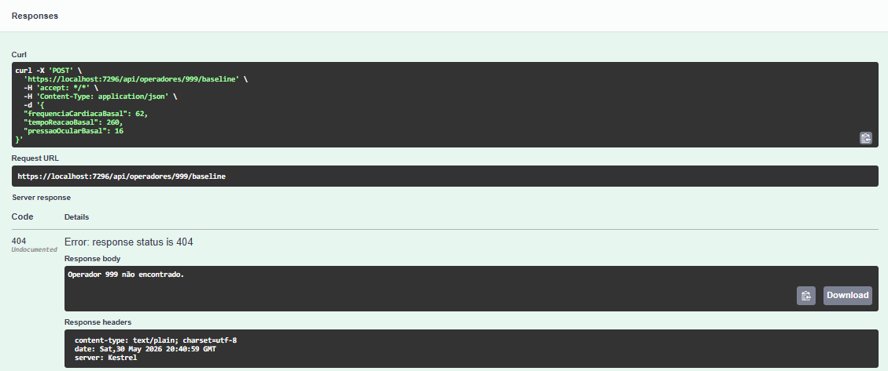

#### Leitura com formato inválido (texto onde é número) → `400`

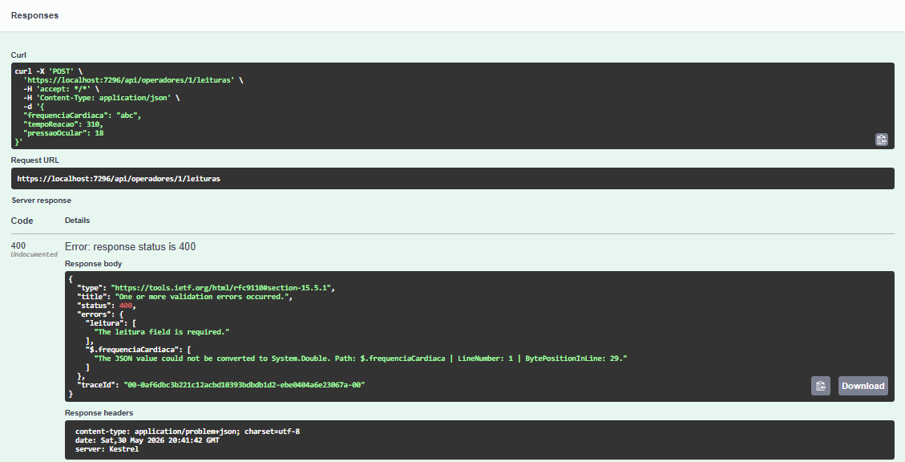

#### Ranking de missão sem operadores → `404`

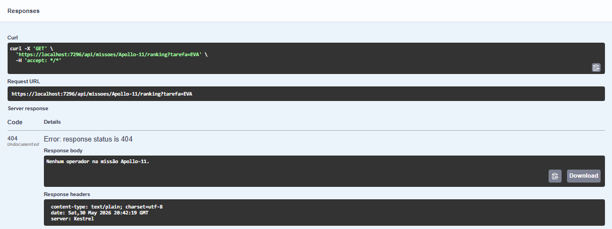

---

## 9. API no Swagger

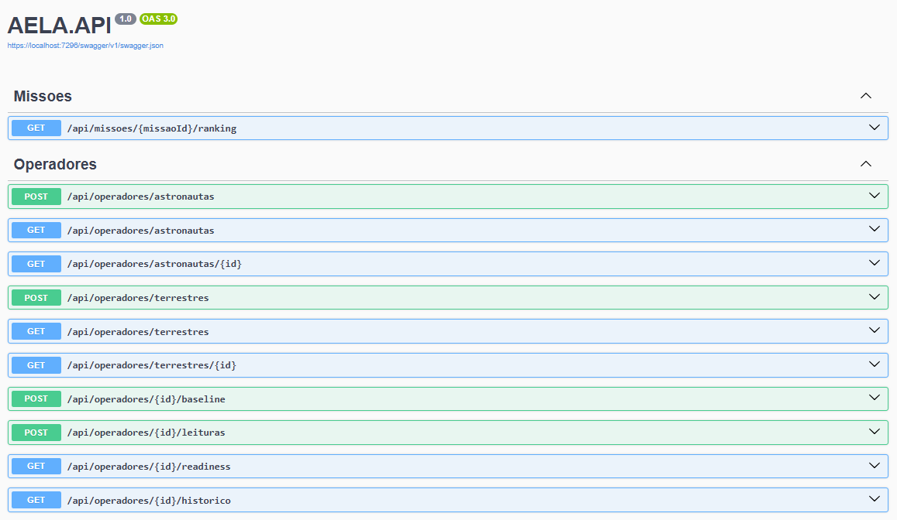

---

## 10. Banco de Dados (Oracle)

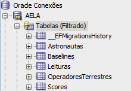

---

## 11. Demonstração integrada (vídeo de IoT)

O vídeo da entrega da matéria de IoT & IOB demonstra a camada de coleta biométrica por visão computacional do AELA funcionando em tempo real
 - Captura de fadiga ocular (EAR)
 - Frequência cardíaca (rPPG)
 - Fadiga postural por câmera

Sem nenhum sensor de contato. Ao cruzar o limite de fadiga, o sistema emite uma recomendação acionável de descanso indicando qual sinal a disparou.
Esses sinais são exatamente o tipo de leitura fisiológica que esta API C# consome no endpoint POST /api/operadores/{id}/leituras para então calcular o ReadinessScore.

[Vídeo de demonstração (IoT & IOB)](https://www.youtube.com/watch?v=MLCUc-tqRk4)
